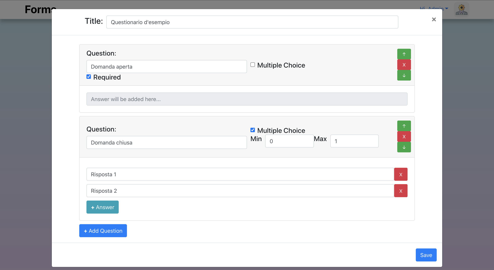

# Exam #1: "Questionario"

Working Demo:
https://tranquil-fjord-01307.herokuapp.com/

## Student: TESTA MARIO

## React Client Application Routes

- Route `/`: root of the project, renders `Feed` component which contains all available forms (surveys).

- Route `/login`: renders `Auth` component, which allows admins to sign in.

- Route `/compile?form=:id`: renders `CompileForm` component only if the HTTP GET request has stored a non-empty list of questions (given `id` of form in the URL), if not, redirects to root route `/`.
  Request to insert a name and proceed to show questions, answers and allows unsigned users to compile the survey.

- Route `/dashboard`: renders `Dashboard` component after signing in, contains all the forms made by the admin and allows reviewing results and adding a new Form.

- Route `/*`: unknown pathnames render `NotFound` component.

## API Server

- GET `/api/forms`
  - Request: _None_
  - Response: `200 OK` (success) or `500 Internal Server Error` (generic error).

Response body: An array of objects, each describing a form.

```
[{
    "id": 1,
    "title": "CPD Web Applications I",
    "user": 1,
    "voters" : 3
},
{
    "id": 2,
    "title": "Questionario Tesi Laurea",
    "user": 2,
    "voters" : 2
},
...
]
```

- POST `/api/forms`
  - Request body: A object describing a form.

```
{
    "title": "CPD Web Applications I",
    "user": 1,
    questions: [{question},...]
}
```

- Response: `201 CREATED` (success) or `503 Service Unavailable` (generic error).

- GET `/api/questions/:id`
  - Request: _None_
  - Response: `200 OK` (success) or `500 Internal Server Error` (generic error).

Response body: An array of objects, each describing a question with a formId = id.

```
[{
    "id": 1,
    "text": "Descrivi brevemente la tua esperienza con il corso.",
    "open": 1,
    "form": 1,
    "min": null,
    "max": null,
    "required": 1
}, {
    "id": 2,
    "text": "Quale parte hai preferito?",
    "open": 0,
    "form": 1,
    "min": 1,
    "max": 1,
    "required": null,
    "options": [{
        "id": 1,
        "text": "Introduzione",
        "question": 2,
        "votes": 0
    }, ... ]
},
...
]
```

- GET `/api/closedanswers/:id`
  - Request: _None_
  - Response: `200 OK` (success) or `500 Internal Server Error` (generic error).

Response body: An array of objects, each describing an answer with questionId = id.

```
[{
    "id": 1,
    "text": "Introduzione",
    "question": 2,
    "votes": 0
}, {
    "id": 2,
    "text": "Static HTML/CSS",
    "question": 2,
    "votes": 0
},
...
]
```

- POST `/api/useranswers`
  - Request body: A object describing a compiled form.

```
{
    "formId": 1,
    "name": "Mario",
    list: [{answers},...]
}
```

- Response: `201 CREATED` (success) or `503 Service Unavailable` (generic error).

- GET `/api/useranswers/:id`
  - Request: _None_
  - Response: `200 OK` (success) or `500 Internal Server Error` (generic error).

Response body: An array of objects, each describing an compiled form given formId.

```
[{
    "name": "Mario",
    "formId": 1,
    "replies": [{answers}...],
},
{
  "name": "Giuseppe",
    "formId": 1,
    "replies": [{answers}...],
},
...
]
```

- GET `/api/adminforms`
  - Request: _None_
  - Response: `200 OK` (success) or `500 Internal Server Error` (generic error).

Response body: An array of objects, each describing a form made by admin.
A different api is used to ensure user.id can be only retrieved through isLoggedIn middleware.

```
[{
    "id": 1,
    "title": "CPD Web Applications I",
    "user": 1,
    "voters" : 3
},
{
    "id": 4,
    "title": "Compito di scienze",
    "user": 1,
    "voters" : 2
},
...
]
```

- GET `/api/question/:id`
  - Request: _None_
  - Response: `200 OK` (success) or `500 Internal Server Error` (generic error).

Response body: An object representing a question, this is used to easily retrieve infos for a single question

```
{
    "id": 1,
    "text": "Descrivi brevemente la tua esperienza con il corso."
}
```

- GET `/api/answer/:id`
  - Request: _None_
  - Response: `200 OK` (success) or `500 Internal Server Error` (generic error).

Response body: An object representing an answer, this is used to easily retrieve infos for a single answer

```
{
    "text": "Static HTML/CSS"
}
```

## Database Tables

- Table `forms` - contains:
  1. id: unique form id
  2. title: form title
  3. user: id of admin who added the form
  4. voters: number of people who completed and sended the form
- Table `questions` - contains:
  1. id: unique question id
  2. question: description of the question
  3. open: boolean (1 or 0) if it is an open or closed question
  4. form: form id
- Table `closedanswersdb` - contains:
  1. id: unique id for each closed answer
  2. answer: description of the answer
  3. question: question id
  4. num_of_votes: `unused` it could be useful to keep track of how many votes an answer has got and display it during review
- Table `useranswers` - contains:
  1. name: name of user who compiled the form
  2. formId: id of form which has been compiled
  3. json: a string representing a list of all the answers given and relative parameters
- Table `user` - contains:
  1. id
  2. email
  3. password
  4. name
- Table `sqlite_sequence` (automatically created by SQLite) - contains:
  1. name: table name which uses autoincrement in one or more columns
  2. seq: keeps last rowid saved

## Main React Components

- `Nav` (in `Nav.js`): contains the navbar with brand name and signin/signout link
- `Auth` (in `Auth.js`): contains the whole page rendered by `/login`, which consists on 2 sides, one with a gradient colored background and the other one with a Boostrap Form to fire login functionalities.
- `AddForm` (in `AddForm.js`): contains the modal that appears when its 'show' prop becomes 'true' and is used to allow admin to add a new form to db.
  There are more sub-components rendering question cards and html inputs for answers, but the whole form is packed inside a single state dynamically updated on every change related to it.
  (This component is ONLY accessible by admins).
- `CompileForm` (in `CompileForms.js`): contains a Bootstrap Form built using questions infos, those are retrieved with a HTTP GET Request at mount time and using param coming from URL. (N.B. Component is bug free: if URL has a unexisting formId, the user will be redirected to `Feed` or `Dashboard` component).
  (This component isn't accessible by admins).
- `Feed` (in `Feed.js`): contains the whole page rendered by `/`, it retrieves all available forms by db at mount time and shows them in a vertical carousel of cards. It sends to `CompileForm` if a "Reply" button is clicked.
  (This component isn't accessible by admins).
- `Dashboard` (in `Dashboard.js`): contains the whole page rendered by `/dashboard`, it retrieves only available forms made by authenticated user at mount time (but updates when adding a new survey) and shows them in a vertical carousel of cards.
  (This component is ONLY accessible by admins).
- `Results` (in `Dashboard.js`): it allows to review results, retrieving the json from /api/useranswers and then parsing it to be rendered inside a table.
- `NotFound` (in `NotFound.js`): contains the whole 404 page rendered if the user navigates to a unknown pathname.

## Screenshot

Dashboard > New Form:


## Users Credentials

- username: `admin@forms.com`, password: `password` -> (Forms: `CPD Web Applications I (2020/21)`, `Compito di Chimica (classe 4A)`)

- username: `prof@forms.com`, password: `password` -> (Forms: `Questionario Tesi Laurea`, `Lista pizze stasera`)
